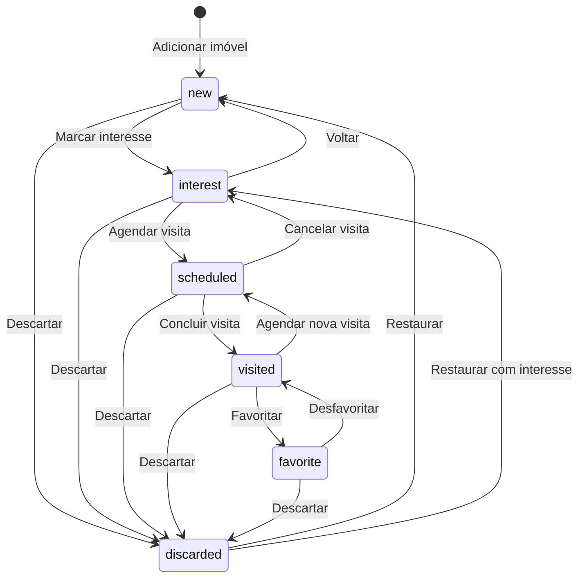

# Nosso Apê — Regras de Negócio

> **Documento de referência de domínio.** Todas as regras de negócio, fluxos e validações do sistema estão aqui.

---

## 1. Conceito do Produto

**Nosso Apê** é um app para casais gerenciarem a busca por apartamento. O nome vem de "Lu+Mí" (Lucas + Mírian). O app centraliza imóveis encontrados em portais diversos, permitindo gestão de visitas, avaliação individual e decisão conjunta.

**Premissas:**
- O casal compartilha um **board** único
- Cada pessoa tem sua **conta individual** com avaliações separadas
- Dados são **sincronizados em tempo real** entre dispositivos
- O app é usado **85% no celular** (mobile-first)

---

## 2. Entidades do Sistema

### 2.1. User (Usuário)

| Campo | Tipo | Obrigatório | Descrição |
|---|---|---|---|
| `id` | UUID | Sim | Supabase Auth UID |
| `email` | string | Sim | Email de login |
| `display_name` | string | Sim | Nome exibido ("Lucas" ou "Mírian") |
| `avatar_url` | string | Não | URL do avatar (Google) |
| `board_id` | UUID | FK | Board ao qual pertence |
| `created_at` | timestamp | Sim | Auto |

**Regras:**
- Um user pode pertencer a **exatamente 1 board**
- O `display_name` é usado nos cards de avaliação
- Se login via Google, `avatar_url` é extraído automaticamente

---

### 2.2. Board (Board do Casal)

| Campo | Tipo | Obrigatório | Descrição |
|---|---|---|---|
| `id` | UUID | Sim | PK |
| `name` | string | Sim | Nome do board (default: "Nosso Apê") |
| `invite_code` | string(6) | Sim | Código alfanumérico de convite |
| `owner_id` | UUID | FK | Quem criou o board |
| `created_at` | timestamp | Sim | Auto |

**Regras:**
- Um board pode ter **no máximo 2 membros**
- O `invite_code` é gerado automaticamente (6 chars, alfanumérico, uppercase)
- Apenas o `owner` pode gerar novo código de convite
- Ao entrar com o código, o segundo user é automaticamente vinculado ao board
- Se o board já tem 2 membros, o código é rejeitado

---

### 2.3. Property (Imóvel)

| Campo | Tipo | Obrigatório | Descrição |
|---|---|---|---|
| `id` | UUID | Sim | PK |
| `board_id` | UUID | FK | Board do casal |
| `url` | string | Sim | Link original do anúncio |
| `title` | string | Sim | Título (extraído ou manual) |
| `image_url` | string | Não | URL da foto principal |
| `price` | string | Não | Preço como texto (ex: "R$ 2.500/mês") |
| `modality` | enum | Sim | `rent` \| `buy` |
| `address` | string | Não | Endereço completo |
| `neighborhood` | string | Não | Bairro (para filtros) |
| `type` | enum | Sim | `apartment` \| `house` \| `land` \| `commercial` \| `other` |
| `area` | integer | Não | Área em m² |
| `bedrooms` | integer | Não | Número de quartos |
| `bathrooms` | integer | Não | Número de banheiros |
| `parking_spots` | integer | Não | Vagas de garagem |
| `status` | enum | Sim | Status atual (ver seção 3) |
| `added_by` | UUID | FK | User que adicionou |
| `source` | string | Sim | Domínio de origem (auto-extraído da URL) |
| `notes` | text | Não | Observações gerais |
| `created_at` | timestamp | Sim | Auto |
| `updated_at` | timestamp | Sim | Auto |

**Regras:**
- `url` deve ser URL válida (validação de formato)
- `source` é extraído automaticamente da URL (ex: "zapimoveis.com.br" → "ZAP")
- `modality` default: `rent`
- `type` default: `apartment`
- `status` default: `new`
- Ao criar, `added_by` recebe o ID do user logado
- `price` é string para suportar formatos variados ("R$ 2.500/mês", "R$ 450.000")
- Imóvel pertence ao **board**, não ao user — ambos podem editar

---

### 2.4. Rating (Avaliação Individual)

| Campo | Tipo | Obrigatório | Descrição |
|---|---|---|---|
| `id` | UUID | Sim | PK |
| `property_id` | UUID | FK | Imóvel avaliado |
| `user_id` | UUID | FK | Quem avaliou |
| `stars` | integer | Sim | 1 a 5 |
| `notes` | text | Não | Observação pessoal |
| `created_at` | timestamp | Sim | Auto |
| `updated_at` | timestamp | Sim | Auto |

**Regras:**
- **Cada user dá SUA nota separadamente** — não é consenso
- Um user pode ter **no máximo 1 rating por imóvel** (upsert)
- `stars` deve ser inteiro entre 1 e 5 (validação)
- Ao atualizar, `updated_at` é atualizado automaticamente

---

### 2.5. Visit (Visita)

| Campo | Tipo | Obrigatório | Descrição |
|---|---|---|---|
| `id` | UUID | Sim | PK |
| `property_id` | UUID | FK | Imóvel visitado |
| `scheduled_date` | timestamp | Sim | Data/hora agendada |
| `completed` | boolean | Sim | Se a visita aconteceu |
| `impressions` | text | Não | Texto livre pós-visita |
| `mood` | enum | Não | `loved` \| `thinking` \| `neutral` \| `unsure` \| `disliked` |
| `created_at` | timestamp | Sim | Auto |

**Regras:**
- `scheduled_date` não pode ser no passado ao criar (pode ser hoje)
- `completed` default: `false`
- `mood` e `impressions` só podem ser preenchidos quando `completed = true`
- Um imóvel pode ter **múltiplas visitas** (revisitar é permitido)
- Ao agendar visita, o `status` do imóvel automaticamente vai para `scheduled`

---

### 2.6. ProCon (Pró / Contra)

| Campo | Tipo | Obrigatório | Descrição |
|---|---|---|---|
| `id` | UUID | Sim | PK |
| `property_id` | UUID | FK | Imóvel |
| `type` | enum | Sim | `pro` \| `con` |
| `text` | string | Sim | Texto do ponto |
| `added_by` | UUID | FK | Quem adicionou |
| `created_at` | timestamp | Sim | Auto |

**Regras:**
- Qualquer membro do board pode adicionar/remover
- Limite: 20 prós + 20 contras por imóvel (soft limit)
- `text` deve ter entre 3 e 200 caracteres

---

## 3. Status do Imóvel — Máquina de Estados

### 3.1. Estados Possíveis

| Status | Label | Cor | Descrição |
|---|---|---|---|
| `new` | Novo | Azul | Recém-adicionado, não avaliado |
| `interest` | Interesse | Âmbar | Queremos visitar |
| `scheduled` | Agendado | Verde | Visita marcada |
| `visited` | Visitado | Roxo | Já visitamos |
| `favorite` | Favorito | Dourado | Top pick do casal |
| `discarded` | Descartado | Cinza | Não queremos mais |

### 3.2. Transições Válidas



### 3.3. Transições Automáticas

| Trigger | Transição | Condição |
|---|---|---|
| Agendar visita | `* → scheduled` | Qualquer status (exceto `discarded`) |
| Concluir visita | `scheduled → visited` | Visita marcada como `completed` |
| Ambos dão 5 estrelas | `visited → favorite` | *Sugestão automática* (user confirma) |

### 3.4. Gestos de Atalho (Mobile)

| Gesto | Transição |
|---|---|
| Swipe direita | `new → interest` ou `visited → favorite` |
| Swipe esquerda | `* → discarded` |

---

## 4. Sistema de Match

### 4.1. Definição

O "match" compara as avaliações individuais de Lucas e Mírian para o mesmo imóvel.

### 4.2. Cálculo

```typescript
function computeMatch(ratingLucas: number, ratingMirian: number): MatchResult {
  const diff = Math.abs(ratingLucas - ratingMirian)
  
  if (ratingLucas >= 4 && ratingMirian >= 4) {
    return 'super_match'    // 💕 Ambos adoraram!
  }
  
  if (diff <= 1) {
    return 'match'          // 💕 Match! Pensam parecido
  }
  
  if ((ratingLucas >= 4 && ratingMirian <= 2) || 
      (ratingMirian >= 4 && ratingLucas <= 2)) {
    return 'divergence'     // ⚡ Divergência — conversem sobre esse!
  }
  
  return 'neutral'          // Sem badge especial
}
```

### 4.3. Exibição

| Match Result | Badge | Visual |
|---|---|---|
| `super_match` | 💕 Match Perfeito! | Card com borda dourada + glow sutil |
| `match` | 💕 Match! | Badge dourado no card |
| `divergence` | ⚡ Divergência | Badge vermelho + tooltip "Conversem sobre esse!" |
| `neutral` | — | Sem badge |

### 4.4. Regras

- Match só é computado quando **ambos** avaliaram o imóvel
- Se apenas um avaliou, exibe badge "Aguardando avaliação de [nome]"
- Na tela de detalhe, as notas de cada um ficam lado a lado
- Cada um **só vê a nota do outro depois de dar a sua** (evita viés)

> **Spoiler prevention**: ao entrar no detalhe de um imóvel que o outro já avaliou mas você não, a nota do parceiro fica escondida atrás de um blur. Só revela após você dar sua nota.

---

## 5. Extração de Links

### 5.1. Fluxo

```
1. User cola URL no input
2. Frontend detecta URL válida (regex)
3. Frontend chama Edge Function: POST /extract-link { url: "..." }
4. Edge Function faz fetch da URL
5. Edge Function parseia HTML e extrai dados
6. Retorna JSON com dados extraídos
7. Frontend exibe preview com dados
8. User revisa/edita e confirma
9. Imóvel é salvo no Supabase
```

### 5.2. Prioridade de Extração

```
1. JSON-LD (schema.org/RealEstateListing) — mais estruturado
2. Open Graph tags (og:title, og:image, og:description)
3. Meta tags padrão (title, description)
4. HTML parsing (h1, primeiro img, regex de preço)
```

### 5.3. Dados Extraídos

| Dado | Fonte Primária | Fonte Fallback | Regex |
|---|---|---|---|
| Título | `og:title` | `<title>` | — |
| Foto | `og:image` | Primeiro `` > 200px | — |
| Descrição | `og:description` | `<meta description>` | — |
| Preço | JSON-LD `price` | Regex no HTML | `R\$\s*[\d.,]+` |
| Endereço | JSON-LD `address` | Regex no HTML | — |
| Source | URL hostname | — | — |

### 5.4. Portais com Extração Otimizada

| Portal | Qualidade | Notas |
|---|---|---|
| ZAP Imóveis | ⭐⭐⭐⭐⭐ | JSON-LD + OG completo |
| Viva Real | ⭐⭐⭐⭐⭐ | Mesmo grupo do ZAP |
| OLX | ⭐⭐⭐⭐ | OG tags boas |
| QuintoAndar | ⭐⭐⭐⭐ | OG + dados estruturados |
| Imóvel Web | ⭐⭐⭐ | OG básico |
| Genérico | ⭐⭐ | Apenas OG genérico |

### 5.5. Fallback

Se a extração falha completamente:
- Salva o link e o domínio de origem
- Exibe formulário manual para o user preencher
- Tenta usar o favicon do site como thumbnail

---

## 6. Autenticação & Board

### 6.1. Fluxo de Primeiro Acesso

```
1. User abre o app pela primeira vez
2. Tela de login: Google ou Email+Senha
3. Após login, detecta que não tem board
4. Tela de onboarding:
   a. "Criar novo board" → gera board + invite code → exibe código para compartilhar
   b. "Entrar com código" → input de 6 chars → vincula ao board existente
5. Dashboard carrega com dados do board
```

### 6.2. Regras de Auth

| Regra | Detalhe |
|---|---|
| Providers | Google OAuth + Email/Senha |
| Sessão | Persistida no localStorage (Supabase default) |
| Board máximo | 2 membros por board |
| Invite code | 6 chars, uppercase, alfanumérico, regenerável |
| Proteção | RLS no Supabase — user só vê dados do seu board |
| Logout | Limpa sessão, redireciona para login |

### 6.3. Permissões

Ambos os membros do board têm **permissões iguais**. Não há "admin" vs "membro" — é um casal, não uma empresa.

Ambos podem:
- Adicionar/editar/excluir imóveis
- Dar suas avaliações individuais
- Agendar/cancelar visitas
- Adicionar prós/contras
- Mudar status de qualquer imóvel

Exceção:
- Apenas o owner pode **regenerar o invite code**
- Apenas o owner pode **excluir o board** (ação destrutiva, confirmação dupla)

---

## 7. Filtros e Busca

### 7.1. Filtros Disponíveis

| Filtro | Tipo | Default |
|---|---|---|
| Status | Multi-select chips | Todos (exceto descartado) |
| Faixa de preço | Range slider | Min-Max dos imóveis |
| Bairro | Multi-select dinâmico | Todos |
| Tipo de imóvel | Select | Todos |
| Modalidade | Aluguel / Compra / Todos | Todos |
| Rating mínimo | Estrelas (1-5) | Sem filtro |
| Quartos mínimos | Stepper numérico | Sem filtro |
| Match status | Match / Divergência / Todos | Todos |

### 7.2. Ordenação

| Critério | Direção |
|---|---|
| Data de adição | Mais recente primeiro (default) |
| Preço | Menor → Maior ou Maior → Menor |
| Rating médio | Maior primeiro |
| Área | Maior → Menor |

### 7.3. Busca por Texto

- Busca nos campos: `title`, `address`, `neighborhood`, `notes`
- Case-insensitive
- Mínimo 2 caracteres para buscar
- Debounce de 300ms

---

## 8. Validações e Limites

| Entidade | Limite | Justificativa |
|---|---|---|
| Membros por board | 2 | App para casal |
| Imóveis por board | 200 | Suficiente, evita abuso do free tier |
| Prós por imóvel | 20 | Manter conciso |
| Contras por imóvel | 20 | Manter conciso |
| Visitas por imóvel | 10 | Suficiente para revisitas |
| Título do imóvel | 3-200 chars | Validação de tamanho |
| Texto pró/contra | 3-200 chars | Manter conciso |
| Impressões de visita | max 2000 chars | Texto livre |
| URL do imóvel | URL válida | Validação de formato |
| Invite code | 6 chars uppercase | Padrão de código |

---

## 9. Notificações (Futuro — Fase 3)

| Evento | Tipo | Destino |
|---|---|---|
| Parceiro adicionou imóvel | Push | O outro membro |
| Parceiro avaliou (match revelado) | Push | O outro membro |
| Visita em 24h | Push | Ambos |
| Visita em 1h | Push | Ambos |

---

## 10. Glossário

| Termo | Definição |
|---|---|
| **Board** | Espaço compartilhado do casal com todos os imóveis |
| **Property** | Um imóvel cadastrado (via link ou manual) |
| **Rating** | Avaliação individual (1-5 estrelas) de um membro |
| **Match** | Quando ambos dão notas próximas (diff ≤ 1) |
| **Super Match** | Quando ambos dão 4+ estrelas |
| **Divergência** | Quando um dá 4+ e outro dá 2- estrelas |
| **Visit** | Registro de visita agendada ou realizada |
| **Mood** | Reação emocional pós-visita (emoji) |
| **ProCon** | Ponto positivo ou negativo listado pelo casal |
| **Invite Code** | Código de 6 chars para vincular o parceiro ao board |
| **Source** | Portal/site de onde o link do imóvel veio |
| **Modality** | Se o imóvel é para alugar ou comprar |
